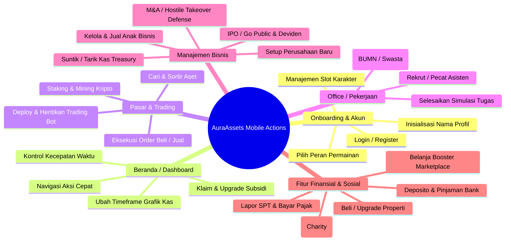
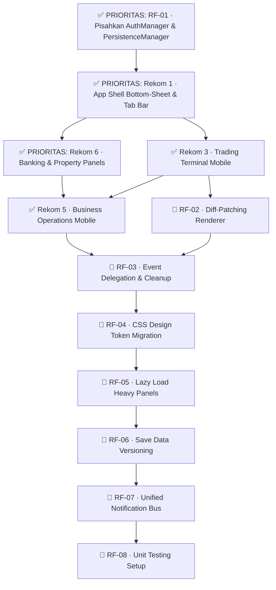

# Rencana Implementasi: Refaktorisasi & Optimalisasi UI/UX Mobile (AuraAssets)

Dokumen ini menjelaskan rencana komprehensif untuk merefaktorisasi antarmuka (UI) dan pengalaman pengguna (UX) game **AuraAssets** agar optimal di perangkat mobile. Melalui analisis mendalam terhadap struktur file HTML, JS, dan CSS saat ini, kami memetakan seluruh aksi di dalam game serta merumuskan rekomendasi arah optimalisasi yang berstandar premium (rich aesthetics, modern typography, glassmorphism, dan micro-animations).

---

## Layar Game & Daftar Aksi Pemain

Berikut adalah daftar seluruh modul halaman dalam game beserta aksi yang dapat dilakukan pemain:



---

## Status Evaluasi Rekomendasi

| # | Modul | Status | Keterangan |
|---|-------|--------|-----------|
| 1 | App Shell & Navigasi Utama | ✅ **APPROVE — PRIORITAS** | Dikerjakan lebih dahulu, blockers lain bergantung padanya |
| 2 | Dashboard / Beranda | 🔄 **PENDING** | Masih belum matang, sebagian sudah diimplementasi user |
| 3 | Pasar & Terminal Trading | ✅ **APPROVE** | Dilanjutkan setelah App Shell selesai |
| 4 | Sistem Office & Karir | 🔄 **PENDING** | Belum matang, belum ada kebutuhan mendesak |
| 5 | Operasi & Tata Kelola Bisnis | ✅ **APPROVE** | Dapat dikerjakan paralel dengan Trading |
| 6 | Layanan Perbankan & Properti | ✅ **APPROVE — PRIORITAS** | Dikerjakan lebih dahulu, banyak aksi finansial krusial |
| 7 | Marketplace & Donasi | 🔄 **PENDING** | Belum matang, prioritas rendah relatif terhadap lainnya |

---

## Rekomendasi Arah Optimalisasi Mobile

### ✅ PRIORITAS — 1. Desain Layout & Navigasi Utama (App Shell)

> **Status: APPROVE — DIKERJAKAN LEBIH DAHULU**

* **Kondisi Saat Ini:**
  * Navigasi desktop menggunakan sidebar kiri (`.app-sidebar`) yang disembunyikan di layar kecil.
  * Navigasi mobile menggunakan bar navigasi bawah (`.app-bottom-nav`) dengan tier tambahan (modal "Lainnya" untuk menu sekunder).
* **Rekomendasi Optimalisasi:**
  * **Bottom Tab Bar Premium:** Tingkatkan bar navigasi bawah dengan efek glassmorphism (`backdrop-filter: blur(20px)`), warna latar transparan gelap HSL, dan batas atas yang sangat tipis berkilau (`border-top: 1px solid rgba(255, 255, 255, 0.08)`).
  * **Transisi Layar Halus:** Implementasikan animasi geser lateral (swipe transitions) yang didukung hardware acceleration (`transform: translate3d`) untuk perpindahan antar-halaman yang terasa organik.
  * **Menu Layanan Bottom-Sheet:** Ubah modal popup "Lainnya" yang saat ini bertipe center-modal menjadi **Bottom-Sheet** yang meluncur ke atas dari bawah layar—seperti aplikasi perbankan modern—sehingga mudah dijangkau oleh ibu jari.
* **File yang Dimodifikasi:**
  * `src/styles/components.css` — animasi `slide-up`, class `.bottom-sheet`
  * `src/js/ui/UIManager.js` — deteksi viewport, inject class bottom-sheet pada openModal
  * `src/styles/main.css` — variabel CSS mobile spacing

---

### 🔄 PENDING — 2. Dashboard / Beranda (`HomeScreen.js`)

> **Status: PENDING — Sebagian fitur (timeframe chart, settings toggle) sudah diimplementasi oleh user. Akan dievaluasi kembali.**

* **Daftar Aksi Pemain:**
  1. Toggle visibilitas saldo (fitur sensor/sembunyikan nilai kas).
  2. Mengubah skala waktu grafik sparkline kekayaan (`1D`, `1W`, `1M`, `YTD`, `1Y`). *(sudah ada)*
  3. Mengklaim dana subsidi pemerintah daerah.
  4. Mengajukan/meningkatkan alokasi dana subsidi.
  5. Menyesuaikan kecepatan waktu game (Pause, Play 1x, Fast Forward 2x/5x/10x).
  6. Membuka menu popup notifikasi dan pengaturan.
* **Catatan Pending:**
  * Timeframe selector (1D/1W/1M/YTD/1Y) sudah diimplementasi di `index.html` & `HomeScreen.js`.
  * `dailyBalanceHistory` dan `tickBalanceHistory` sudah ditambahkan ke `GameState.js`.
  * Perlu dievaluasi kembali setelah App Shell selesai untuk memastikan konsistensi layout.

---

### ✅ APPROVE — 3. Pasar & Terminal Trading (`ViewManager.js` & `TradingPage.js`)

> **Status: APPROVE — Dilanjutkan setelah Rekom 1 (App Shell) selesai**

* **Daftar Aksi Pemain:**
  1. Berpindah tab sub-pasar: Saham, Kripto, Staking/Mining, Bot Trading, Portofolio.
  2. Memfilter aset melalui pencarian teks langsung.
  3. Mengurutkan aset berdasarkan kriteria (Nama, Harga, Perubahan %).
  4. Membuka terminal detail trading per aset saham/kripto.
  5. Menjalankan order pasar/limit (Beli/Jual) dengan input lot atau nilai dolar.
  6. Menggunakan tombol pembantu instan (`MAX`, quick-add presets `+1M`, `+10M`, dll.).
  7. Membatalkan order antrean limit (Pending Orders).
  8. Membeli/menjual Rig Tambang Bitcoin.
  9. Melakukan staking/unstaking koin kripto di vault APY.
  10. Membuat konfigurasi, mendeploy, dan menghentikan Trading Bot otomatis.
  11. Mengunduh kartu performa bot dalam format gambar PNG (Canvas generator).
* **Rekomendasi Optimalisasi:**
  * **Tab Scrollable Tanpa Bungkus (Wrap):** Gunakan `overflow-x: auto` dan sembunyikan scrollbar bawaan browser pada `.tab-group` di layar mobile agar tab tidak patah menjadi beberapa baris.
  * **Compact Asset Row:** Baris daftar saham/kripto harus memprioritaskan visualisasi kompak. Tampilkan Logo/Simbol, Mini Sparkline (opsional), Harga Terakhir, dan Persentase Perubahan dalam satu baris ramping tanpa memaksakan nama perusahaan yang panjang.
  * **Bottom-Sheet Order Form:** Saat pemain mengetuk aset untuk trading, daripada membuka panel penuh yang merusak alur visual, luncurkan panel **Bottom-Sheet Beli/Jual** dengan input angka besar yang dioptimalkan untuk input sentuh mobile.
  * **Fit-to-Screen Canvas Download:** Pastikan canvas kartu performa bot dirender dengan resolusi tinggi secara offscreen, sedangkan preview visual di layar mobile diskalakan dengan CSS (`max-width: 100%`) agar tidak terpotong.
* **File yang Dimodifikasi:**
  * `src/styles/trading.css` — compact row, scrollable tabs
  * `src/js/ui/ViewManager.js` — bottom-sheet order form handler
  * `src/js/trading/panels/StockPanel.js`, `TradingSignalPanel.js` — compact render mode

---

### 🔄 PENDING — 4. Sistem Office & Karir (`WorkPage.js` & `WorkSimulation.js`)

> **Status: PENDING — Belum ada kebutuhan mendesak, akan direview setelah Rekom 3 & 5 selesai.**

* **Daftar Aksi Pemain:**
  1. Memilih jalur karir awal di Career Center.
  2. Mengerjakan tugas rutin, prioritas, dan mendesak secara manual melalui mini-game simulasi.
  3. Merekrut asisten kantor dengan tingkatan (Tier) berbeda.
  4. Memecat/memberhentikan asisten kantor aktif.
* **Catatan Pending:**
  * Tergantung pada finalisasi layout dasar App Shell terlebih dahulu.
  * Fitur simulasi mini-game masih dalam evaluasi desain—belum ada konsep final.

---

### ✅ APPROVE — 5. Operasi & Tata Kelola Bisnis (`BusinessPage.js` & `BusinessManager.js`)

> **Status: APPROVE — Dapat dikerjakan paralel dengan Rekom 3**

* **Daftar Aksi Pemain:**
  1. Menyiapkan nama, tipe, dan industri perusahaan awal.
  2. Menyuntikkan dana pribadi (Inject Cash) atau menarik kas surplus ke akun pribadi (Withdraw).
  3. Membeli, meningkatkan (Upgrade), dan melikuidasi anak perusahaan (Subsidiaries).
  4. Melakukan inisiasi kampanye pemasaran atau optimasi rantai pasokan.
  5. Mendaftarkan IPO perusahaan ke bursa efek (setting kode ticker & alokasi saham publik).
  6. Membagi dividen pemegang saham.
  7. Membeli kembali saham publik (Share Buyback) atau menjual saham cadangan (Issue Shares).
  8. Menolak/menahan upaya Hostile Takeover dari kompetitor AI.
  9. Melikuidasi seluruh aset bisnis (Exit / Bangkrut).
* **Rekomendasi Optimalisasi:**
  * **Accordion Ledger Cashflow:** Tabel rincian arus kas masuk (Inflow) dan keluar (Outflow) bulanan sangat lebar di desktop. Refaktor menjadi sistem **Accordion Dropdown** di mobile, di mana pemain cukup mengetuk kategori untuk melihat rincian pengeluaran.
  * **Card-Based Subsidiaries List:** Tampilkan anak perusahaan dalam bentuk kartu grid vertikal dengan tombol pintasan upgrade yang besar, menggantikan tampilan tabel datar yang sempit.
  * **Wizard Setup Satu Kolom:** Formulir pendirian bisnis baru dirancang ulang agar berorientasi satu kolom vertikal penuh dengan validasi form instan.
* **File yang Dimodifikasi:**
  * `src/js/business/BusinessPage.js` — accordion cashflow, card subsidiaries
  * `src/styles/business.css` — responsive card layout, accordion styles

---

### ✅ PRIORITAS — 6. Layanan Perbankan & Properti (`SavingsPanel.js`, `LoanPanel.js`, `PropertyPanel.js`, `TaxPanel.js`)

> **Status: APPROVE — DIKERJAKAN LEBIH DAHULU (sejajar dengan Rekom 1)**

* **Daftar Aksi Pemain:**
  1. Membuka kontrak Deposito Berjangka (Savings) dan mencairkannya secara manual.
  2. Mengajukan pinjaman (Loan) dan membayar cicilan utang.
  3. Membeli aset real-estate/properti sewaan dari pasar.
  4. Meningkatkan kapasitas sewa properti (Upgrade).
  5. Menjual properti kembali ke pasar sekunder.
  6. Mengisi formulir SPT Pajak bulanan dan menyetorkan pembayaran wajib pajak.
* **Rekomendasi Optimalisasi:**
  * **Shortcuts Input Keuangan:** Sediakan tombol pintasan persentase cepat (`25%`, `50%`, `75%`, `100% / MAX`) di atas kolom input nominal pinjaman atau deposito untuk mempercepat kalkulasi pemain tanpa mengetik angka penuh.
  * **Indikator Jatuh Tempo Grafis:** Tampilkan sisa hari deposit atau sisa tenor pinjaman menggunakan visual progress bar melingkar (circular progress indicator) yang estetik.
  * **Compact Summary Card:** Buat kartu ringkasan keuangan tunggal di bagian atas panel yang menampilkan: Total Aset Tersimpan, Total Utang Aktif, dan Nilai Properti Portfolio—memberikan gambaran cepat tanpa harus scroll ke bawah.
* **File yang Dimodifikasi:**
  * `src/js/finance/panels/SavingsPanel.js` — shortcut buttons, compact summary
  * `src/js/finance/panels/LoanPanel.js` — circular progress tenor
  * `src/js/property/panels/PropertyPanel.js` — card-based property list
  * `src/styles/main.css` — circular progress, shortcut button styles

---

### 🔄 PENDING — 7. Marketplace & Donasi (`MarketplacePanel.js`, `HomeScreen.js`)

> **Status: PENDING — Prioritas rendah, akan direview setelah 6 rekomendasi lainnya selesai.**

* **Daftar Aksi Pemain:**
  1. Membeli jam tangan Rolex dan setelan jas mewah (Booster).
  2. Menjual Rolex kembali saat harga pasar berfluktuasi tinggi.
  3. Memilih organisasi kemanusiaan untuk donasi (Palestina, Panti, Masjid, Korban Bencana).
  4. Menentukan nominal donasi untuk memicu efek keberuntungan (Luck Tick).
* **Catatan Pending:**
  * Grid item dan visualisasi item marketplace masih sederhana; butuh desain konsep lebih matang sebelum dieksekusi.

---

## 🚀 Saran Optimalisasi Skala Refactor

Berikut adalah saran-saran optimalisasi berskala besar yang menyentuh arsitektur kode, performa runtime, dan maintainability jangka panjang. Saran ini **tidak harus langsung dieksekusi**, namun sangat direkomendasikan untuk dimasukkan ke dalam roadmap teknis.

---

### RF-01 · State Management: Pisahkan `GameState` dari UI

**Masalah:** `GameState.js` saat ini bertanggung jawab terlalu banyak — menyimpan data, mengatur persistence localStorage, mengelola akun/login, dan memicu event UI. Ini melanggar prinsip *Single Responsibility*.

**Saran:**
- Pisahkan `AuthManager` (login, register, session) ke file tersendiri.
- Pisahkan `PersistenceManager` (save/load/migration localStorage) ke file tersendiri.
- `GameState` hanya bertugas sebagai *in-memory state store* murni dengan event emitter.

**Dampak:** Memudahkan unit testing, mengurangi bug akibat side effect tersembunyi, dan membuat kode lebih mudah dibaca oleh kontributor baru.

---

### RF-02 · Render Engine: Adopsi Virtual DOM Ringan atau Diff-Patching

**Masalah:** Saat ini, sebagian besar panel (seperti `ViewManager`, `HomeScreen`, `BusinessPage`) me-render ulang seluruh `innerHTML` setiap kali ada perubahan state—meskipun hanya satu angka yang berubah. Ini menyebabkan:
- Input yang sedang diketik pengguna kehilangan fokus (*input blur bug*).
- Animasi CSS yang sedang berjalan ter-reset.
- Performa jelek di perangkat mobile entry-level.

**Saran:**
- Implementasikan fungsi `patch(domElement, newHTML)` ringan yang membandingkan children lama dan baru, hanya memperbarui node yang benar-benar berubah.
- Atau adopsi library micro seperti `morphdom` (2KB gzip) yang sudah battle-tested untuk use case ini.
- Sebagai langkah minimal: selalu periksa `document.activeElement` sebelum re-render dan skip jika ada input aktif di dalam panel tersebut. *(Sudah dilakukan sebagian di ViewManager—perluas ke panel lain.)*

---

### RF-03 · Event System: Hindari Memory Leak dari Event Listener

**Masalah:** Setiap kali `HomeScreen.showSettingsModal()` atau panel apapun di-render ulang, event listener baru ditambahkan ke elemen DOM baru tanpa menghapus listener lama. Seiring waktu ini menyebabkan memory leak dan handler duplikat (satu klik memicu fungsi dua kali atau lebih).

**Saran:**
- Gunakan pattern **event delegation**: daripada `btn.addEventListener(...)` per elemen, pasang satu listener ke parent container dan gunakan `event.target.closest('[data-action]')` untuk menangkap aksi.
- Buat helper `ui.bindDelegated(container, '[data-action]', handlers)` di `UIManager.js` untuk standarisasi pattern ini.
- Untuk listener yang tidak bisa didelegasi (seperti `gameState.on(...)` di dalam component): selalu simpan referensi unsubscribe dan panggil saat component di-unmount.

---

### RF-04 · CSS Architecture: Migrasi dari Inline Style ke Design Token

**Masalah:** Ribuan baris kode JavaScript mengandung inline style langsung (`style="font-size: 0.75rem; color: #a1a1aa; ..."`). Ini membuat:
- Perubahan tema visual sangat sulit (harus ganti satu per satu di JS, bukan CSS).
- Mobile responsiveness sulit dikontrol (inline style tidak bisa di-override oleh media query tanpa `!important`).
- Bundle JS membengkak karena membawa string HTML/CSS yang seharusnya ada di file CSS.

**Saran:**
- Definisikan semua nilai berulang sebagai CSS Custom Properties di `main.css`: `--text-xs`, `--text-sm`, `--space-1`, `--color-muted`, dll.
- Buat komponen CSS class terstandar: `.card-compact`, `.badge-success`, `.row-data`, `.label-field`, dll.
- Secara bertahap ganti inline style di template literal JS dengan class reference.

---

### RF-05 · Performance: Lazy Load Panel yang Berat

**Masalah:** Seluruh modul JS (BusinessPage, GamblingPanel, TradingSignalPanel, dll.) di-import dan dieksekusi saat halaman pertama kali dimuat, meskipun pemain belum membuka panel tersebut. Ini memperpanjang Time-to-Interactive secara signifikan di perangkat mobile.

**Saran:**
- Gunakan **dynamic import** (`import()`) untuk panel-panel berat:
  ```javascript
  // Di ViewManager.js / navigasi
  case 'business':
    const { default: businessPage } = await import('./business/BusinessPage.js');
    businessPage.render();
    break;
  ```
- Panel yang paling kandidat untuk lazy load: `GamblingPanel.js`, `TradingSignalPanel.js`, `BusinessPage.js`, `PropertyPanel.js`.
- Tampilkan skeleton loader saat modul sedang di-fetch untuk pengalaman yang mulus.

---

### RF-06 · Data Integrity: Versioning pada Save Data

**Masalah:** Saat struktur `getDefaultState()` ditambah field baru (seperti `dailyBalanceHistory`, `tickBalanceHistory`), save data lama yang tidak memiliki field tersebut akan menyebabkan `undefined` errors atau state yang tidak konsisten saat di-load.

**Saran:**
- Tambahkan field `_saveVersion: 1` (integer) di dalam state.
- Buat sistem migration: `MigrationManager.migrate(savedData, currentVersion)` yang mengaplikasikan patch secara bertahap:
  ```javascript
  // v1 → v2: tambah dailyBalanceHistory
  if (version < 2) {
    state.dailyBalanceHistory = [];
    state.tickBalanceHistory = [];
  }
  ```
- Simpan `currentSaveVersion` sebagai konstanta di `GameState.js` sehingga mudah ditracking.

---

### RF-07 · UX Polish: Unified Toast & Notification System

**Masalah:** Saat ini notifikasi muncul dari beberapa tempat dengan format berbeda: `ui.success()`, `ui.error()`, `ui.info()`, serta `gameState.emit()` yang memicu notifikasi tambahan di bell icon. Tidak ada koordinasi antara keduanya, sehingga pesan bisa muncul dua kali atau saling menimpa.

**Saran:**
- Buat satu **Notification Bus** terpusat di `UIManager.js`.
- Semua notifikasi (toast dan bell notification) dirouting melalui bus ini.
- Bus menentukan apakah pesan hanya muncul sebagai toast, hanya masuk bell, atau keduanya—berdasarkan level prioritas pesan (`info`, `success`, `warning`, `critical`).
- `critical` selalu masuk bell dan tampil sebagai toast. `info` hanya toast. `warning` keduanya.

---

### RF-08 · Testing: Tambahkan Unit Test untuk Logic Keuangan Kritis

**Masalah:** Tidak ada test coverage untuk logika keuangan yang krusial seperti: perhitungan bunga deposito, kalkulasi cicilan pinjaman, net worth, dan kenaikan level karakter. Bug kecil di sini bisa berakibat fatal bagi kemajuan pemain.

**Saran:**
- Gunakan **Vitest** (sudah kompatibel dengan Vite, zero-config) untuk menulis unit test.
- Prioritaskan testing untuk:
  - `FinanceManager.js` — `addIncome`, `addExpense`, `getMonthlySummary`
  - `GameState.js` — `getNetWorth`, `mergeState`, `save`/`load` round-trip
  - `BankSystem.js` — kalkulasi bunga dan cicilan
- Target coverage minimal 60% untuk file-file di atas sebelum fitur baru ditambahkan.

---

## Urutan Eksekusi yang Disarankan



---

## Rencana Verifikasi (Verification Plan)

### Pengujian Otomatis & Alat Bantu
- **Chrome DevTools Device Emulation:** Lakukan audit dan simulasi interaksi menggunakan profil perangkat mobile populer (iPhone SE, iPhone 12/13/14 Pro, Samsung Galaxy S20 Ultra, dan Pixel 7).
- **Responsive Layout Diagnostic Script:** Jalankan script diagnosa di console browser untuk memindai elemen DOM yang melebihi batas lebar layar (horizontally overflowing elements).

### Verifikasi Manual
1. **Touch Target Accessibility Test:** Verifikasi semua tombol aksi cepat, tab pasar, tombol beli/jual rig, dan slot kerja di layar mobile simulator untuk memastikan area sentuh minimum 44x44 piksel dan tidak saling bertindih.
2. **Keyboard Focus Flow:** Uji alur pengisian form modal (seperti input nominal donasi, transfer treasury, dan setup nama perusahaan) untuk memastikan keyboard bawaan mobile tidak menghalangi kolom input aktif atau tombol konfirmasi utama.
3. **Canvas Performance Test:** Verifikasi bahwa pengunduhan kartu performa trading bot di mobile menghasilkan gambar yang presisi tanpa ada bagian teks yang terpotong.
4. **Save/Load Round-Trip:** Setelah RF-06 (versioning) diimplementasi, uji load save data lama memastikan tidak ada field `undefined` atau crash saat migration.
